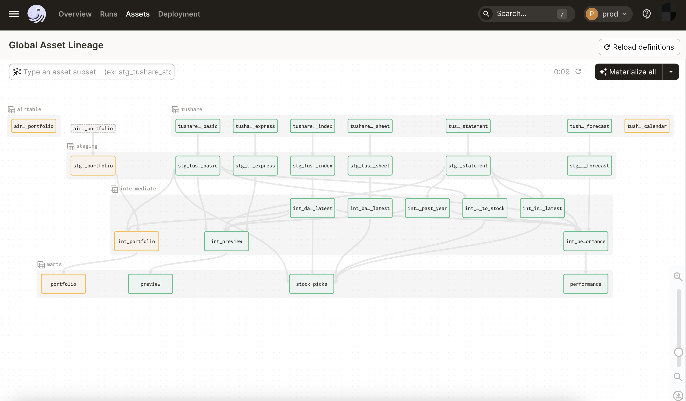
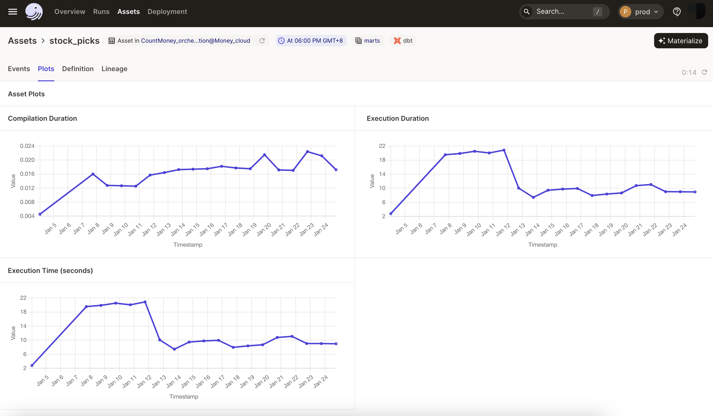
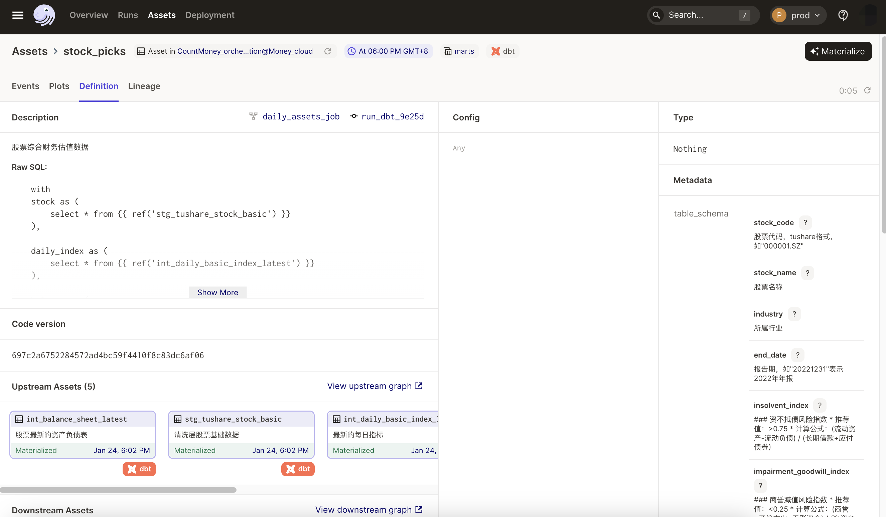
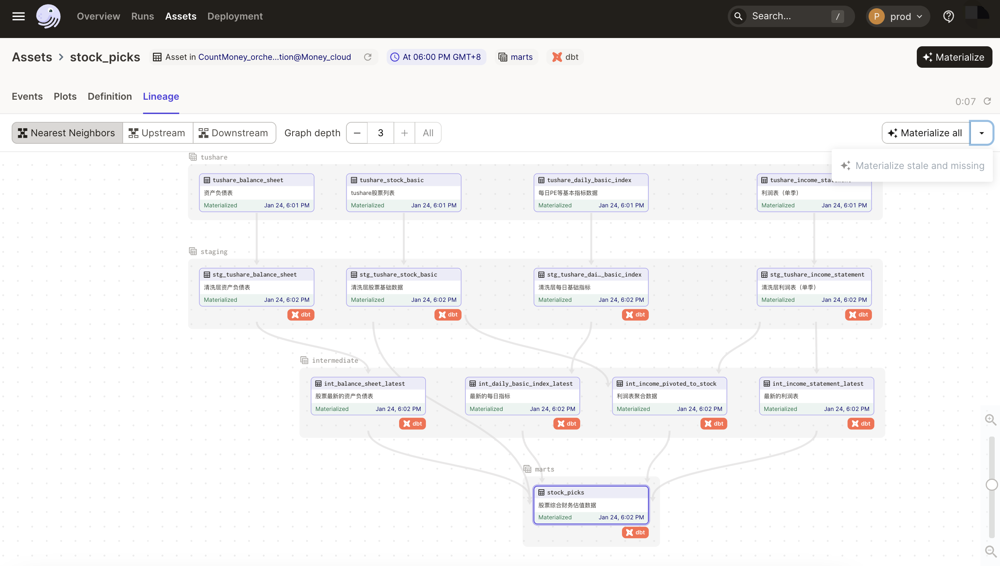
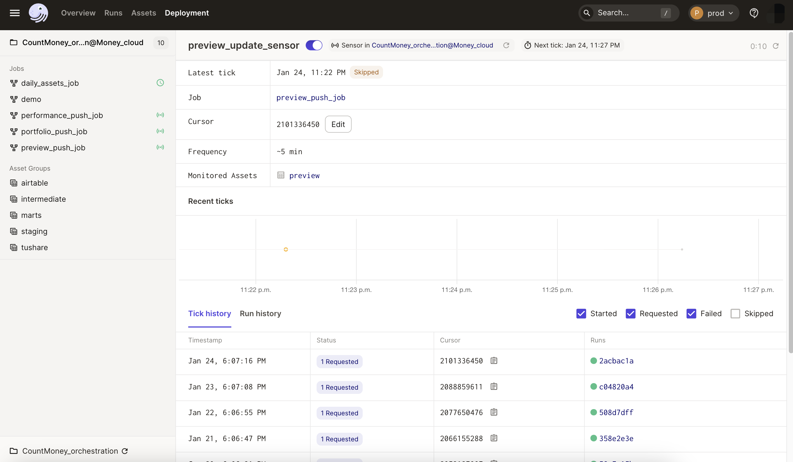
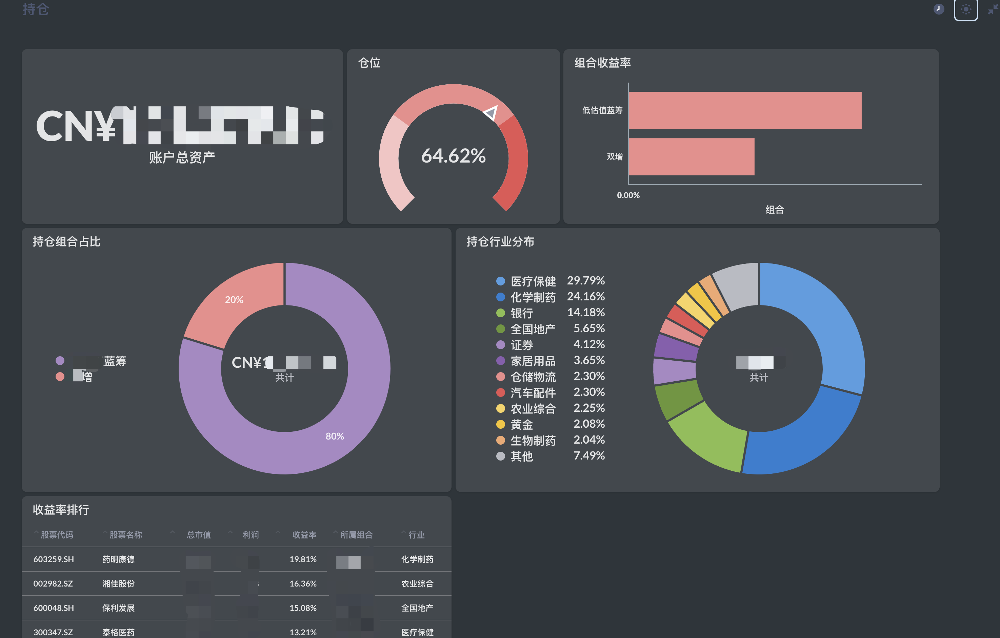
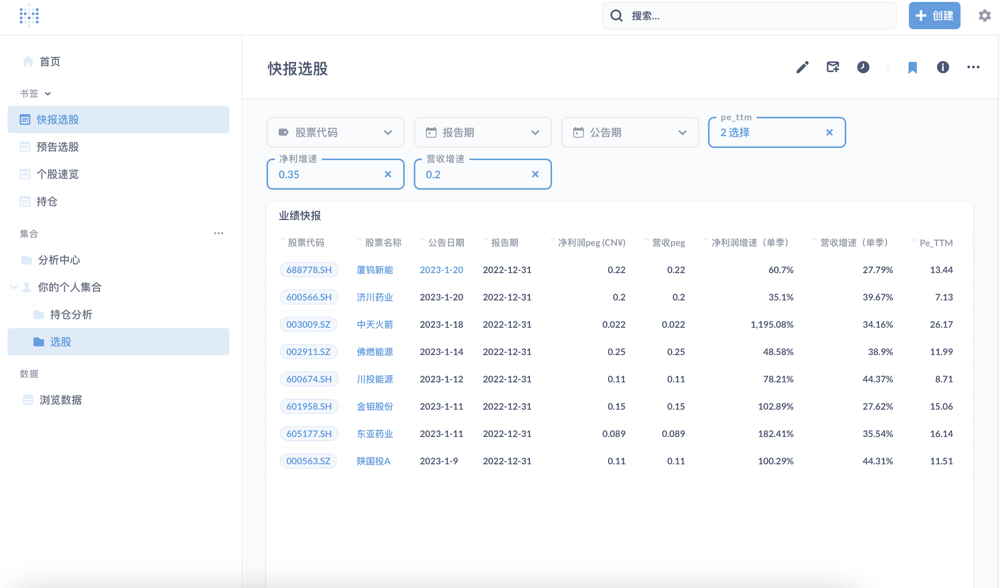
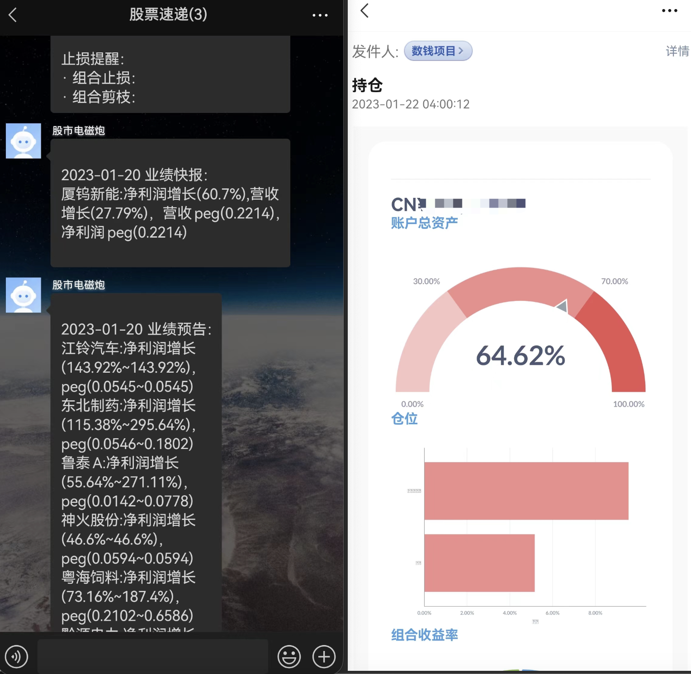

# CountMoney

## Overview

The vision of CountMoney is helping individual investors to establish declarative data pipeline and manage your finance data in your warehouse.I compose the system of the following components, most of which are modern data stack components, meaning that the system is flexible and plug-and-play. You can switch to other components that you are familiar with. For example, in the EL part, you can switch to Airbyte or Fivetrans, etc. You can also write Python programs to do data conversion. But note Dagster is the scheduling orchestration tool for this system. It is the foundation of this system. And you cannot replace it.

* datasources
  * Finance data: [Tushare](https://tushare.pro/document/1) , a low-cost financial database, covering most Chinese stock market. If you purchase ¥500/yearly plan, you can use all api.
  * Other data: [Airtable](https://airtable.com/), store some sensitive data , such as portfolio, costs, etc.
* extract & load: Ingestion as code, just write assets in orchestration code, and load data to postgres. IO logic is in ./resources/xxx_io_manager.py
* orchestration: Dagster cloud.
* Transformation: DBT.
* BI: Metadata, running on docker.
* Subcription
  * wxwork webhook
  * email

## Features

### Pipeline Management

* Orchestrating daily job by software-defined asset.
* Manage assets.
* Launch a run whenever another job materializes a specific asset.

### Visualization

### Subscription

## Models

* stock picks: all stock list with defence metrics and growth metrics
* performance: choose stocks with high growth from the stocks that released the performance forecast
* preview: choose stocks with high growth from the stocks that released the preview
